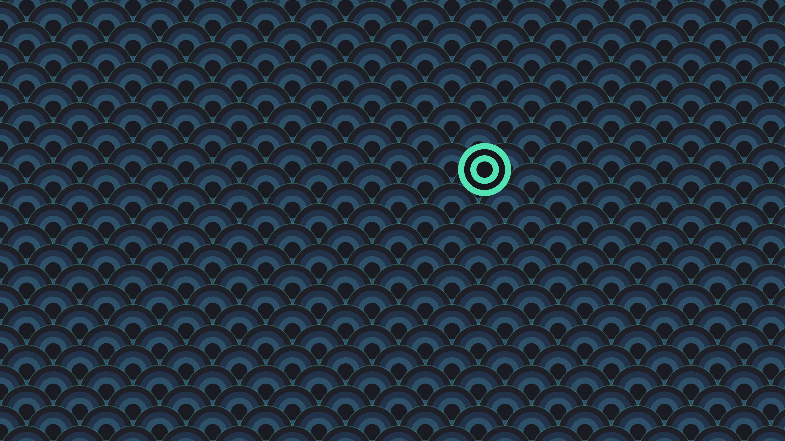
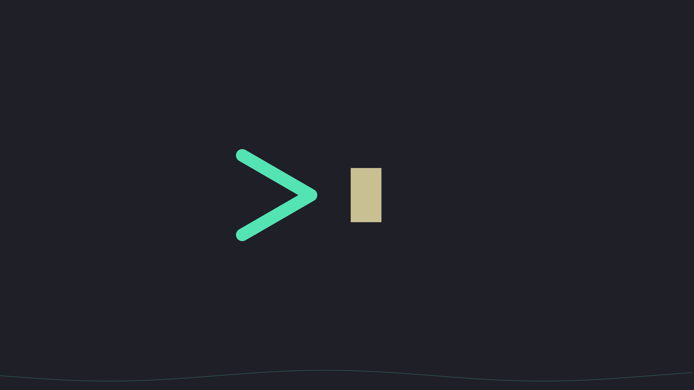

# Kanagawa Mint-Csupo

**Traditional Japanese earth tones meets high-energy cyberpunk mint.**

A [Kanagawa](https://github.com/rebelot/kanagawa.nvim)-derived color scheme with an
electric mint accent — inspired by 90s 16-bit games and the Klasky-Csupo art style.
Sumi ink backgrounds, warm parchment text, and `#54e3b2` deployed exactly where your
eye needs to go.

## Palette

| | | | |
| :--- | :--- | :--- | :--- |
| Editor `#1f1f28` | Chrome `#181820` | Panels `#1a1a22` | Deep ink `#16161d` |
| **Mint** `#54e3b2` | Parchment `#c8c093` | Violet `#b06ecf` | Terracotta `#ff9e3b` |

Full token reference: [SPEC.md](SPEC.md) (v1.3.0)

## Ports

| Platform | Where | Install |
| :--- | :--- | :--- |
| **VS Code / VSCodium** | [`ports/vscode/`](ports/vscode/) | Marketplace/Open VSX (soon), or `vsce package` + install the .vsix |
| **Zed** | [`ports/zed/`](ports/zed/) | Extensions → Install Dev Extension → select folder |
| **Neovim** | [`ports/neovim/`](ports/neovim/) | Copy `colors/` into your config → `:colorscheme kanagawa-mint-csupo` |
| **JetBrains IDEs** | [`ports/jetbrains/`](ports/jetbrains/) | Settings → Editor → Color Scheme → Import Scheme (.icls) |
| **Sublime Text** | [`ports/sublime/`](ports/sublime/) | Drop into Packages/User → Select Color Scheme |
| **Obsidian** | [`ports/obsidian/`](ports/obsidian/) | Copy to `<vault>/.obsidian/themes/Kanagawa Mint-Csupo/` |
| **Firefox** | [`ports/firefox/`](ports/firefox/) | AMO (pending), or `about:debugging` → Load Temporary Add-on |
| **Chrome / Brave / Edge** | [`ports/chromium/`](ports/chromium/) | `chrome://extensions` → Developer mode → Load unpacked |
| **Vivaldi** | [`ports/vivaldi/`](ports/vivaldi/) | Settings → Themes → Import |
| **Windows Terminal** | [`ports/windows-terminal/`](ports/windows-terminal/) | Paste into the `"schemes"` array of `settings.json` |
| **Windows 11** | [`ports/windows/`](ports/windows/) | See [setup guide](ports/windows/kmc-windows-setup.md) — `.theme`, `.reg`, or apply script |
| **kitty** | [`ports/kitty/`](ports/kitty/) | `include kanagawa-mint-csupo.conf` |
| **Alacritty** | [`ports/alacritty/`](ports/alacritty/) | `import` in alacritty.toml |
| **WezTerm** | [`ports/wezterm/`](ports/wezterm/) | Drop in `colors/` → `color_scheme = "Kanagawa Mint-Csupo"` |

Marketplace submission steps for all of the above: [SUBMITTING.md](SUBMITTING.md)

## Wallpapers

Seven 4K originals in [`wallpapers/`](wallpapers/), all rendered to spec by the
scripts in [`wallpapers/scripts/`](wallpapers/scripts/) — something for everybody:

| | |
| :--- | :--- |
|  **wave** — the flagship: striped sun, layered seas |  **dusk** — crescent moon, violet haze, stormier water |
|  **gridwave** — synthwave horizon grid |  **csupo** — memphis doodles, maximum Klasky-Csupo |
|  **seigaiha** — traditional wave-scale pattern |  **prompt** — a single mint chevron |
|  **minimal** — near-flat ink, one crest line | |

## Tools

**[tools/kmc-recolor.html](tools/kmc-recolor.html)** — open in any browser, drop in
any image, and it remaps it to the Mint-Csupo palette by luminance. 100% local,
zero dependencies. Strength slider + "mint pop" toggle.

## License

Themes, spec, and artwork: [CC BY-SA 4.0](https://creativecommons.org/licenses/by-sa/4.0/).
Scripts (`.ps1`): MIT. Built on the palette of
[kanagawa.nvim](https://github.com/rebelot/kanagawa.nvim) (MIT) by rebelot.

— Dark Lunch Studios
